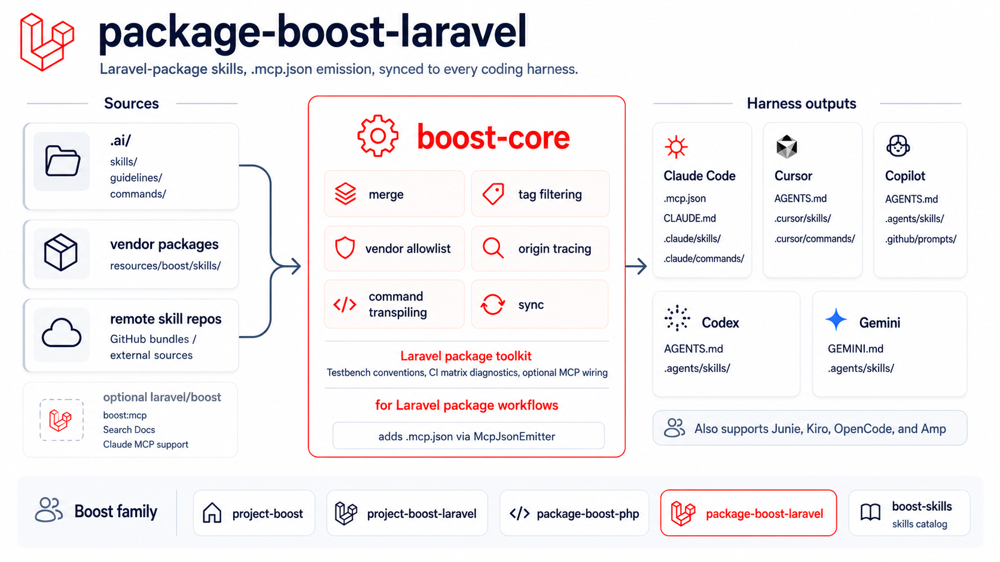

# package-boost-laravel

[](https://packagist.org/packages/sandermuller/package-boost-laravel)
[](https://github.com/sandermuller/package-boost-laravel/actions/workflows/run-tests.yml)
[](https://packagist.org/packages/sandermuller/package-boost-laravel)
[](LICENSE)
[](https://github.com/laravel/boost)

AI agent skills, guidelines, and `.mcp.json` emission for Laravel-package authors. Inherits the framework-agnostic package-author toolkit from [`sandermuller/package-boost-php`](https://github.com/sandermuller/package-boost-php) and layers on Laravel-specific context: Testbench conventions, cross-version Laravel support, CI matrix diagnostics, and the `McpJsonEmitter` that wires `laravel/boost`'s MCP server into Claude Code during `boost sync`.

**Documentation: <https://sandermuller.github.io/boost-core/packages/package-boost-laravel/>**



> Where [`laravel/boost`](https://github.com/laravel/boost) targets Laravel
> **application** developers, this package targets the people building Laravel
> **packages** — the dev-time codebase where `app/`, `bootstrap/` and `.env` do
> not exist and `php artisan` does not apply. Not sure which family member fits?
> The [picker](https://sandermuller.github.io/boost-core/guide/which-package)
> decides it in two questions.

## What you get

**`McpJsonEmitter`** — the zero-overlap claim against `laravel/boost`. It updates `.mcp.json` on every `boost sync`, idempotently, with the command pointed at `vendor/bin/testbench boost:mcp` (not `php artisan`) so the MCP server actually boots in a package codebase. It merges rather than overwrites: only `mcpServers.laravel-boost` is touched, so your own servers, other top-level keys, and extra keys on that entry survive, and a `.mcp.json` it cannot parse is left alone. It fires only when `laravel/boost` and `orchestra/testbench` are both in your dev dependencies **and** `Agent::CLAUDE_CODE` is active; otherwise it skips silently.

**Three Laravel skills.** All untagged, so they ship whenever this package is installed.

| Skill | When it loads |
|---|---|
| `package-development` | Testbench conventions: `vendor/bin/testbench` versus `php artisan`, service-provider registration in `testbench.yaml`, the `workbench/` layout |
| `cross-version-laravel-support` | Several Laravel majors in one release: constraint patterns, version shims, the CI matrix shape including `prefer-lowest` |
| `ci-matrix-troubleshooting` | Debugging "fails on prefer-lowest" and "fails on Laravel 13 but not 12" matrix failures |

**One Laravel guideline** — `laravel-packages`. The detection rule (`require.illuminate/*` or `require.laravel/framework`), Testbench context, the artisan-substitution table, and a cross-version pointer. It composes with the framework-agnostic `foundation` guideline inherited from `package-boost-php`.

Everything `package-boost-php` ships comes along: the `foundation` guideline, the `lean` and `gitattributes` CLI commands, and the `lean-dist` skill.

## Install

```bash
composer require --dev sandermuller/package-boost-laravel
vendor/bin/boost install   # pick agents and allowlist vendors
vendor/bin/boost sync      # fan skills + guidelines out
```

PHP 8.3+ and Laravel 12 or 13. `sandermuller/package-boost-php`, `sandermuller/boost-core`, and `stolt/lean-package-validator` all come in transitively — do **not** require any of them separately.

Allowlist both package vendors in `boost.php`, since inheritance is a Composer dependency and not an allowlist entry:

```php
return BoostConfig::configure()
    ->withAgents([Agent::CLAUDE_CODE, Agent::COPILOT, Agent::CODEX])
    ->withAllowedVendors([
        'sandermuller/boost-skills',
        'sandermuller/package-boost-laravel',
        'sandermuller/package-boost-php',
    ])
    ->withTags([Tag::Php, Tag::Laravel, Tag::Github, 'release-automation']);
```

## Documentation

| Topic | Page |
|---|---|
| `McpJsonEmitter`, the skills, what it inherits | [Overview](https://sandermuller.github.io/boost-core/packages/package-boost-laravel/) |
| Install and first run | [Install](https://sandermuller.github.io/boost-core/packages/package-boost-laravel/install) |
| `boost.php`, tags, inheritance, coexistence, auto-sync | [Configuration](https://sandermuller.github.io/boost-core/packages/package-boost-laravel/configuration) |
| Writing a custom `FileEmitter` | [Publishing a skill package](https://sandermuller.github.io/boost-core/packages/boost-core/publishing-skills) |
| Tags, skill dependencies, remote skills, conventions | [Guide](https://sandermuller.github.io/boost-core/guide/what-is-boost) |
| Every command and exit code | [CLI reference](https://sandermuller.github.io/boost-core/reference/cli) |

The semver-protected surface is in [PUBLIC_API.md](PUBLIC_API.md). Everything else is `@internal`.

## Testing

```bash
composer test
```

## License

MIT. See [LICENSE](LICENSE).
